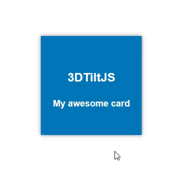

# 3DTiltJS
JS library to add a 3D tilting effect to a container



## Install

You can download one of the files with those links from jsDelivr CDN :
  * standard : [3DTilt.js](https://cdn.jsdelivr.net/gh/LucentDread/3DTiltJS@main/3DTilt.js)
  * minified : [3DTilt.min.js](https://cdn.jsdelivr.net/gh/LucentDread/3DTiltJS@main/3DTilt.min.js)

or include it directly in your page :
```html
<script src="https://cdn.jsdelivr.net/gh/LucentDread/3DTiltJS@main/3DTilt.js"></script> <!-- Standard -->  
<script src="https://cdn.jsdelivr.net/gh/LucentDread/3DTiltJS@main/3DTilt.min.js"></script> <!-- Minified -->  
```

## Usage

Apply the ```tilting``` to your container and wrap it to another with the ```wrap``` class

You can adjust the tilting strength with the ```data-maxshear="<value>"``` (max = 0.01, default = 0.001)

You can adjust the box-shadow strength with the ```data-maxshadow="<value>"``` (default = 1/30th of the smallest length of the container)

